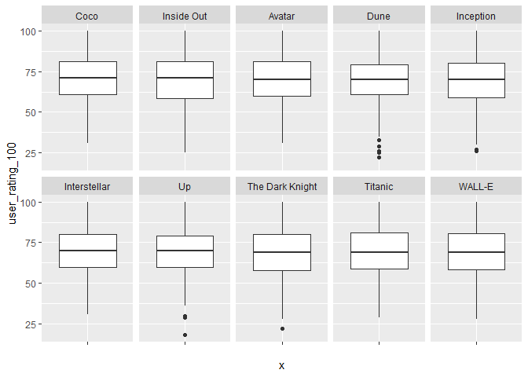
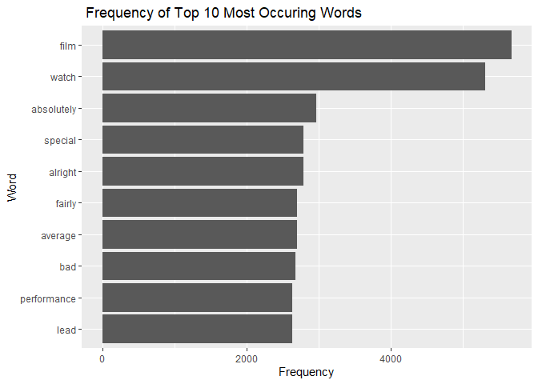
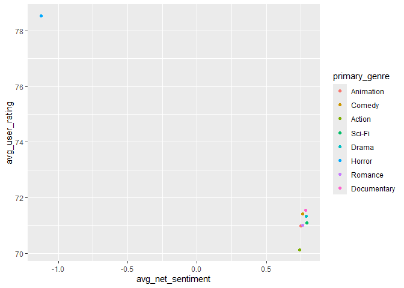

# Coursework 1: MA22019, Introduction to Data Science
Replace With Your Name

<!--- DO NOT DELETE THIS LINE --->

<!--- METADATA ANCHOR: MA22019-CW1-2026 --->

Please read the `coursework_01_instructions.pdf` for the full context,
data dictionary, and detailed task requirements before starting.

``` r
library(tidyverse)
library(tidytext)
library(knitr)
```

## Part A: Data Wrangling & EDA

### Task 1: Data Joining

<!--- DO NOT DELETE THIS LINE - TASK 1 ANCHOR --->

``` r
# Write your Task 1 code here:

history <- read_csv("data/history.csv")
```

    Rows: 20276 Columns: 7
    ── Column specification ────────────────────────────────────────────────────────
    Delimiter: ","
    chr (2): watch_date, review_snippet
    dbl (5): user_id, movie_id, watch_duration_mins, engagement_score, user_rati...

    ℹ Use `spec()` to retrieve the full column specification for this data.
    ℹ Specify the column types or set `show_col_types = FALSE` to quiet this message.

``` r
titles <- read_csv("data/titles.csv")
```

    Rows: 110 Columns: 5
    ── Column specification ────────────────────────────────────────────────────────
    Delimiter: ","
    chr (2): movie_title, genre_tags
    dbl (3): movie_id, release_year, budget_usd

    ℹ Use `spec()` to retrieve the full column specification for this data.
    ℹ Specify the column types or set `show_col_types = FALSE` to quiet this message.

``` r
users <- read_csv("data/users.csv")
```

    Rows: 2500 Columns: 3
    ── Column specification ────────────────────────────────────────────────────────
    Delimiter: ","
    chr (1): subscription_type
    dbl (2): user_id, age

    ℹ Use `spec()` to retrieve the full column specification for this data.
    ℹ Specify the column types or set `show_col_types = FALSE` to quiet this message.

``` r
history_clean <- history %>% unique ()
titles_clean <- titles %>% unique()
users_clean <- users %>% unique()

cinemetrics <- history_clean %>% 
                  left_join (users_clean, by = 'user_id') %>% 
                    left_join(titles_clean , by = 'movie_id')

nrow(history)
```

    [1] 20276

``` r
nrow(history_clean)
```

    [1] 19965

``` r
nrow(titles)
```

    [1] 110

``` r
nrow(titles_clean)
```

    [1] 100

``` r
nrow(cinemetrics)
```

    [1] 19965

<!--- WRITE YOUR WRITTEN ANSWER BELOW THIS LINE --->

#### Written Interpretation

It was necessary to remove duplicates from history to avoid counting the
same viewing record more than once, and duplicates had to be removed
from the titles data frame because otherwise repeated movie_id rows
would create duplicate matches in the join and artificially increase the
final row count.

### Task 2: Missing Values Handling

<!--- DO NOT DELETE THIS LINE - TASK 2 ANCHOR --->

``` r
# Write your Task 2 code here:

missing_summary <- tibble (
  variable = colnames ( cinemetrics) , 
  missing_values = colSums(is.na(cinemetrics))
) %>%  arrange(desc(missing_values))

missing_summary %>% knitr::kable(caption = "Missing values per variable")
```

| variable            | missing_values |
|:--------------------|---------------:|
| review_snippet      |           1939 |
| user_rating_100     |            985 |
| budget_usd          |            980 |
| engagement_score    |            582 |
| watch_duration_mins |            574 |
| age                 |             50 |
| subscription_type   |             50 |
| user_id             |              0 |
| movie_id            |              0 |
| watch_date          |              0 |
| movie_title         |              0 |
| release_year        |              0 |
| genre_tags          |              0 |

Missing values per variable

``` r
user_rating_median <- median(cinemetrics$user_rating_100 , na.rm = TRUE)
user_rating_median
```

    [1] 71

<!--- WRITE YOUR WRITTEN ANSWER BELOW THIS LINE --->

#### Written Interpretation

It is important to use explicit missing-value functions because they
directly identify and count NA values, whereas generic overview
functions may not clearly report missingness, which can lead to
misinterpretation of the dataset and misleading summary statistics such
as the mean, median, or mode; this issue is especially common for
character variables, where missing values are often not clearly
flagged.This happens because those columns are treated as text rather
than numerical variables, so the output may only preview values instead
of explicitly counting NAs.

### Task 3: Genre Grouping

<!--- DO NOT DELETE THIS LINE - TASK 3 ANCHOR --->

``` r
# Write your Task 3 code here:

cinemetrics |>
  count(genre_tags, sort = TRUE)
```

    # A tibble: 22 × 2
       genre_tags                      n
       <chr>                       <int>
     1 animated                     1667
     2 animation                    1633
     3 comedy, family               1516
     4 Science fiction              1480
     5 sci-fi, fantasy              1376
     6 comedy                       1369
     7 drama, emotional             1213
     8 drama, critically-acclaimed  1158
     9 scary                        1010
    10 rom-com                      1009
    # ℹ 12 more rows

``` r
cinemetrics <- cinemetrics %>% 
  mutate ( primary_genre = genre_tags %>% 
             as_factor() %>% 
             fct_collapse(
               'Animation' = c("animated", "animation", "animation, kids"),
               'Comedy' = c("comedy", "comedy, family"),
              'Sci-Fi' = c("Science fiction", "sci-fi", "sci-fi, fantasy"),
              'Drama' = c("Drama", "drama, emotional", "drama, critically-acclaimed"),
              'Horror' = c("horror", "scary", "terror"),
              'Romance' = c("Romance", "rom-com", "romantic", "romantic comedy"),
              'Action' = c("action", "action, high-octane"),
              'Documentary' = c("Documentary", "documentary, real-world")
              )
  )


levels(cinemetrics$primary_genre)
```

    [1] "Animation"   "Comedy"      "Action"      "Sci-Fi"      "Drama"      
    [6] "Horror"      "Romance"     "Documentary"

``` r
cinemetrics %>% count(primary_genre, sort = TRUE)
```

    # A tibble: 8 × 2
      primary_genre     n
      <fct>         <int>
    1 Animation      4207
    2 Sci-Fi         3543
    3 Drama          3307
    4 Comedy         2885
    5 Romance        2295
    6 Horror         1798
    7 Action         1585
    8 Documentary     345

##### comment: There were no sub categories left that did not fit into a category called other hence I have exactly 8 levels

``` r
# Write your verification code here:

rating_verification <- cinemetrics %>% 
  filter ( genre_tags == 'Romance' | genre_tags =='romantic comedy') %>% 
  group_by( genre_tags) %>% 
  summarize ( avg_user_rating_100 = mean(user_rating_100,na.rm = TRUE),
              n = n())

rating_verification %>%
  knitr::kable(caption = "Comparison of raw Romance and romantic comedy genre tags")
```

| genre_tags      | avg_user_rating_100 |   n |
|:----------------|--------------------:|----:|
| Romance         |            69.82660 | 991 |
| romantic comedy |            66.35036 | 145 |

Comparison of raw Romance and romantic comedy genre tags

<!--- WRITE YOUR WRITTEN ANSWER BELOW THIS LINE --->

#### Written Interpretation

Collapsing the romantic comedy subgroup into the broader Romance
category masks its lower average rating, because its mean score of 66.35
across 145 observations is diluted within the much larger Romance group,
which has a higher average rating of 69.83 across 991 observations. This
is called aggregation distortion.

### Task 4: Genre Ratings Table

<!--- DO NOT DELETE THIS LINE - TASK 4 ANCHOR --->

``` r
# Write your Task 4 code here:

genre_ratings <- cinemetrics %>% 
  group_by(primary_genre)%>% 
  summarize ( avg_user_rating_100 = mean(user_rating_100,na.rm = TRUE)) %>%   arrange(desc (avg_user_rating_100))

genre_ratings %>% knitr::kable ( caption = "Average User rating for Primary genre")
```

| primary_genre | avg_user_rating_100 |
|:--------------|--------------------:|
| Horror        |            79.77719 |
| Comedy        |            70.07359 |
| Drama         |            69.83692 |
| Documentary   |            69.73333 |
| Animation     |            69.69912 |
| Sci-Fi        |            69.68587 |
| Romance       |            69.54708 |
| Action        |            69.21661 |

Average User rating for Primary genre

``` r
# Write your verification code here:


budget_verification <- cinemetrics %>% 
  filter(primary_genre=="Action"| primary_genre =="Sci-Fi"|primary_genre == "Horror") %>% 
  group_by(primary_genre) %>% 
  summarise( avg_budget_usd = mean(budget_usd, na.rm= TRUE), .groups = "drop")%>% 
  arrange(desc(avg_budget_usd))
  
budget_verification %>% knitr::kable(caption = "Average Budget in USD")
```

| primary_genre | avg_budget_usd |
|:--------------|---------------:|
| Sci-Fi        |      139588009 |
| Action        |      115543533 |
| Horror        |       10181094 |

Average Budget in USD

<!--- WRITE YOUR WRITTEN ANSWER BELOW THIS LINE --->

#### Written Interpretation

The empirical results show that a higher production budget does not
guarantee a higher average user rating. Sci-Fi has the highest average
budget at 139,588,009 USD and Action also has a very high average budget
of 115,543,533 USD, yet their average user ratings are only 69.69 and
69.22 respectively. In contrast, Horror has by far the lowest average
budget at 10,181,094 USD but the highest average user rating at 79.78.
This suggests that higher spending alone does not determine audience
evaluation.

A broad category such as Action may hide important sub-genre
differences, because averaging across many films can conceal weaker
niche groups, as seen earlier in Task 3 where romantic comedy (66.35)
was masked within the broader Romance category (69.83).

More generally, the poor performance of a small niche film group can be
concealed when it is absorbed into a large collapsed category whose
average is driven by many other films.

### Task 5: Ratings and Engagement Scores

<!--- DO NOT DELETE THIS LINE - TASK 5 ANCHOR --->

``` r
# Write your Task 5 code here:

top_10_movies <- cinemetrics %>% 
  count(movie_title , sort = TRUE) %>% 
  top_n(10)
```

    Selecting by n

``` r
top_10_ratings <- cinemetrics %>% 
  inner_join(top_10_movies, by = "movie_title" ) %>% 
  mutate ( movie_title = fct_reorder(movie_title,user_rating_100,.fun = median, .desc = TRUE,.na_rm = TRUE))
  
ggplot (data = top_10_ratings , aes (x = "", y = user_rating_100)) + geom_boxplot() + facet_wrap( ~movie_title , nrow = 2)
```

    Warning: Removed 255 rows containing non-finite outside the scale range
    (`stat_boxplot()`).



<!--- WRITE YOUR WRITTEN ANSWER BELOW THIS LINE --->

#### Written Interpretation

Up contains the lowest individual user rating among the 10 most-watched
movies, as shown by the lowest outlier point on the plot which falls
below 25. Its relatively narrow box also suggests a smaller
interquartile range approximately from 58 to 72, meaning the middle 50%
of ratings are more tightly clustered and audience opinion is more
consistent.

``` r
# Write your verification code here:

top_10_ratings_IQR <- top_10_ratings %>% 
  group_by(movie_title) %>% 
  summarize( IQR_rating = IQR(user_rating_100,na.rm = TRUE) ) %>% 
  arrange(desc(IQR_rating))
  
top_10_ratings_IQR %>% knitr::kable(caption = "IQR of user ratings for 10 most watched movies")
```

| movie_title     | IQR_rating |
|:----------------|-----------:|
| Inside Out      |       22.5 |
| The Dark Knight |       22.0 |
| Titanic         |       22.0 |
| WALL-E          |       22.0 |
| Avatar          |       21.0 |
| Inception       |       21.0 |
| Coco            |       20.0 |
| Interstellar    |       20.0 |
| Up              |       19.0 |
| Dune            |       18.0 |

IQR of user ratings for 10 most watched movies

#### Empirical Verification

Inside Out has the highest IQR range of 22.5 and Dune has the lowest IQR
range of 18.

### Task 6: Engagement Score and Subscription Type

<!--- DO NOT DELETE THIS LINE - TASK 6 ANCHOR --->

``` r
# Write your Task 6 code here:

engagement_2d <- cinemetrics %>%  
  filter (!is.na(subscription_type)) %>% 
  group_by(subscription_type) %>% 
  summarise(avg_engagement_score = mean(engagement_score, na.rm = TRUE))

engagement_2d %>% knitr::kable(caption = "Average engagement score by subscription type")
```

| subscription_type | avg_engagement_score |
|:------------------|---------------------:|
| Basic             |             44.03936 |
| Premium           |             56.47616 |

Average engagement score by subscription type

``` r
age_quartiles <- cinemetrics$age %>% 
  quantile(probs = c(0.25,0.50,0.75), na.rm = TRUE )

age_quartiles
```

    25% 50% 75% 
     25  35  45 

``` r
cinemetrics <- cinemetrics %>% 
  mutate( age_tier = case_when(age <= 25 ~ "Q1",
                               age <= 35 ~ "Q2",
                               age <= 45 ~ "Q3", 
                               age > 45 ~ "Q4" ))

engagement_3d <- cinemetrics %>% 
  filter (!is.na(subscription_type), !is.na(age_tier)) %>% 
  group_by(subscription_type , age_tier) %>% 
  summarise(avg_engagement_score = mean(engagement_score,na.rm = TRUE))
```

    `summarise()` has grouped output by 'subscription_type'. You can override using
    the `.groups` argument.

``` r
# Write your verification code here:

engagement_verification <- cinemetrics %>% 
  filter (!is.na(subscription_type), !is.na(age_tier)) %>% 
  group_by(subscription_type , age_tier) %>% 
  summarise(user_count = n ())
```

    `summarise()` has grouped output by 'subscription_type'. You can override using
    the `.groups` argument.

``` r
engagement_verification %>% 
tidyr :: pivot_wider( names_from = subscription_type , values_from = user_count)
```

    # A tibble: 4 × 3
      age_tier Basic Premium
      <chr>    <int>   <int>
    1 Q1        4958     447
    2 Q2        3523    1496
    3 Q3         994    3762
    4 Q4         557    4178

#### Empirical Verification

Basic users are concentrated in the younger age groups, with 4958 users
in Q1 (under 25 years old) and 3523 in Q2 (25 to 35 years old), while
Premium users are concentrated in the older age groups, with 3762 users
in Q3 (35 to 45 years old) and 4178 in Q4 (over 45 years old). This
shows that the two subscription types are distributed unevenly across
age, which is likely to distort the overall comparison of engagement
scores.

<!--- WRITE YOUR WRITTEN ANSWER BELOW THIS LINE --->

#### Written Interpretation

The 2D analysis suggests that premium users are engaged more overall
with an average engagement score of 56.48 whereas basic users have an
average engagement score of 44.04 overall.However, the 3D analysis shows
the opposite pattern within every age tier, where Basic users have
higher average engagement than Premium users in Q1 (28.94 vs 12.66), Q2
(50.93 vs 38.24), Q3 (74.34 vs 55.10), and Q4 (80.10 vs 68.77). This is
called the Simpsons paradox where an overall trend reverses after
controlling for a third variable. It occurs here because the
subscription types are distributed very unevenly across age tiers: Basic
users are concentrated in the younger, lower-engagement groups, while
Premium users are concentrated in the older, higher-engagement groups.
As a result, the overall engagement averages are driven by differences
in age composition rather than subscription type alone.

------------------------------------------------------------------------

## Part B: Text Data Analysis

### Task 7: Tokenization & Word Frequency

<!--- DO NOT DELETE THIS LINE - TASK 7 ANCHOR --->

``` r
# Write your Task 7 code here:

tidy_tokenized_review <- cinemetrics %>% 
  filter(!is.na(review_snippet)) %>%
  select(review_snippet) %>% 
  unnest_tokens(output = word , input = review_snippet) %>% 
  anti_join (stop_words , by ="word") %>% 
  count (word, sort = TRUE )

top_10_words <- tidy_tokenized_review %>% 
  head(10)

top_10_words
```

    # A tibble: 10 × 2
       word            n
       <chr>       <int>
     1 film         5674
     2 watch        5317
     3 absolutely   2970
     4 alright      2788
     5 special      2788
     6 average      2698
     7 fairly       2698
     8 bad          2680
     9 lead         2640
    10 performance  2640

``` r
ggplot(top_10_words, aes( x= reorder(word,n) , y = n )) + geom_col() + labs( x = "Word" , y = "Frequency" , title = " Frequency of Top 10 Most Occuring Words") +coord_flip()
```



<!--- WRITE YOUR WRITTEN ANSWER BELOW THIS LINE --->

#### Written Interpretation

The two most frequent non-stop words are film and watch with a frequency
of 5674 and 5317 respectively, but these words provide very little
useful insight because they are generic terms that are naturally
expected to appear often in movie reviews. They do not explain why
audiences rated a movie highly or what makes a specific genre
distinctive, since they are not tied to particular themes, emotions, or
stylistic features. As a result, simple word frequency is limited here,
and a measure such as TF-IDF is more useful for identifying words that
are more distinctive and informative within particular genres or review
groups.

### Task 8: Sentiment Analysis

<!--- DO NOT DELETE THIS LINE - TASK 8 ANCHOR --->

``` r
# Write your Task 8 code here:

bing_lexicon <- get_sentiments("bing")

review_sentiment <-  cinemetrics %>% 
  filter(!is.na(review_snippet),!is.na(primary_genre),!is.na(user_rating_100)) %>%
  mutate(review_id = row_number()) %>% 
  select(review_id,primary_genre,user_rating_100,review_snippet) %>% 
  unnest_tokens(output = word , input = review_snippet) %>% 
  inner_join(bing_lexicon, by= "word") %>% 
  mutate( sentiment_value = if_else(sentiment=="positive", +1 , -1 )) %>% 
  group_by(review_id,primary_genre,user_rating_100) %>% 
  summarise(net_sentiment= sum(sentiment_value))
```

    `summarise()` has grouped output by 'review_id', 'primary_genre'. You can
    override using the `.groups` argument.

``` r
genre_sentiment <- review_sentiment %>% 
  group_by(primary_genre) %>% 
  summarise( avg_net_sentiment = mean(net_sentiment) , 
             avg_user_rating = mean (user_rating_100))

ggplot(genre_sentiment, aes(x=avg_net_sentiment, y = avg_user_rating ,colour = primary_genre )) + geom_point()
```



<!--- WRITE YOUR WRITTEN ANSWER BELOW THIS LINE --->

#### Written Interpretation

The clear anomaly on the scatter plot is Horror, which sits far to the
left with a negative average net sentiment of roughly -1,12, yet has the
highest average user rating at around 78.5. This differs from the rest
of the genres, which cluster together with positive average sentiment
values around 0.75 to 0.80 and ratings near 71 to 71.5.

This semantic anomaly occurs because the Bing lexicon classifies words
individually as positive or negative without considering context, so
reviews in Horror may contain lexically negative words that are used in
a praising or genre-specific way.

In addition, because Horror is a collapsed category containing multiple
smaller genres, its language patterns are likely to be more mixed and
less well captured by a simple sentiment lexicon.

For example, words such as “terrifying” or “disturbing” may be labelled
as negative, even though in the context of a horror or intense film
review they can actually express praise. As a result, the average
sentiment score may appear artificially low even when the films are
highly rated by audiences.

### Task 9: Advanced Text Mining (TF-IDF)

<!--- DO NOT DELETE THIS LINE - TASK 9 ANCHOR --->

``` r
# Write your Task 9 code here: 


# method 1 (works fyn with n but gives non zero tfidf for all romance and primary_genres and non zeroes only for others )

unique_words <- cinemetrics %>%
  filter(!is.na(review_snippet), !is.na(primary_genre)) %>%
  unnest_tokens(output = word, input = review_snippet) %>%
  anti_join(stop_words, by = "word") %>%
  count(primary_genre, word, sort = TRUE) %>% 
  bind_tf_idf(term = word , document = primary_genre , n = n ) %>% 
  arrange(primary_genre, desc(tf_idf))
  
top_unique_word <- unique_words %>%
  group_by(primary_genre) %>%
  arrange(desc(tf_idf), .by_group = TRUE) %>%
  slice_head(n = 1) %>%
  select(primary_genre, word, tf_idf)
  
romance_unique <-  unique_words %>%
  filter(primary_genre == "Romance")

### for more better analysis lets try removing the word "watch" to see if there are any genre distinguishing words ###

unique_words_2<- cinemetrics %>%
  filter(!is.na(review_snippet), !is.na(primary_genre)) %>%
  unnest_tokens(output = word, input = review_snippet) %>%
  anti_join(stop_words, by = "word") %>%
  filter( word!= "watch") %>% 
  count(primary_genre, word, sort = TRUE) %>% 
  bind_tf_idf(term = word , document = primary_genre , n = n ) %>% 
  arrange(primary_genre, desc(tf_idf))

  
top_unique_word_2<- unique_words_2 %>%
  group_by(primary_genre) %>%
  arrange(desc(tf_idf), .by_group = TRUE) %>%
  slice_head(n = 1) %>%
  select(primary_genre, word, tf_idf)

romance_unique_2 <-  unique_words_2 %>%
  filter(primary_genre == "Romance")
```

<!--- WRITE YOUR WRITTEN ANSWER BELOW THIS LINE --->

#### Written Interpretation

1.  TF-IDF score for “film” is 0

2.  This occurs because the inverse document frequency part of the
    TF-IDF formula is 0 for film. Although film appears frequently in
    Romance reviews, it also appears across all genre documents in the
    dataset, so its IDF becomes log(total no.of genres/ no. of genres
    containing the word film) = log(8/8) = log(1) = 0, which forces the
    overall TF-IDF score to 0.

3.  The top 3 TF-IDF words in Romance are “watch”, “average” and
    “fairly” with scores of 0.014,0.0077 and 0.0077 respectively,
    whereas the top 3 frequency words are “film” , “watch” and “average”
    with frequencies of 697, 680 and 359 respectively.

TF-IDF gives a better summary because it downweights words such as film
that are very common across all genres and therefore not distinctive to
Romance. Although watch and average still appear in both lists, TF-IDF
improves the summary by prioritising words based on uniqueness as well
as frequency, rather than frequency alone.

As an additional exploratory check, I removed watch, since it had the
highest TF-IDF score in 7 of the 8 genres, but this produced only
limited change: Romance still remained dominated by generic words such
as average, fairly, and bad.

This suggests that the difference is modest because Romance reviews
still contain quite generic vocabulary, but TF-IDF still gives a more
genre-specific view than raw word counts. However in genres such as
Horror the difference is much clearer, where a word like scary receives
a much higher TF-IDF score (0.28) and provides a more distinctive
summary of the genre.

### Task 10: Executive Recommendation

<!--- DO NOT DELETE THIS LINE - TASK 10 ANCHOR --->

<!--- WRITE YOUR WRITTEN ANSWER BELOW THIS LINE --->

#### Written Interpretation

cineMetrics should focus on converting younger Basic users into Premium
through targeted content and upgrade offers rather than simply
increasing spending on expensive genres. Task 6 shows that although
Premium users appear more engaged overall (56.48 vs 44.04), Basic users
are actually more engaged within every age tier, while younger groups
are heavily concentrated in Basic subscriptions (Q1: 4958 vs 447; Q2:
3523 vs 1496), suggesting untapped upgrade potential. Task 4 also shows
that higher budgets do not guarantee stronger audience response: Horror
has the highest average rating (79.78) despite the lowest average budget
(10,181,094 USD), while Sci-Fi (139,588,009 USD; 69.69) and Action
(115,543,533 USD; 69.22) perform worse. Task 9 further suggests that
some genres, especially Horror, generate more distinctive audience
language than others. A limitation is that review snippets are short and
genre collapsing may hide sub-genre variation.Another, limitation is
that sentiment analysis using the bing lexicon does not account for
genre context, meaning words like “terrifying” may be incorrectly
classified as negative even when they signal positive reception in
Horror films.

------------------------------------------------------------------------

<!--- WORD COUNT ANCHOR --->

    **Prose Word Count:** 1370 words
